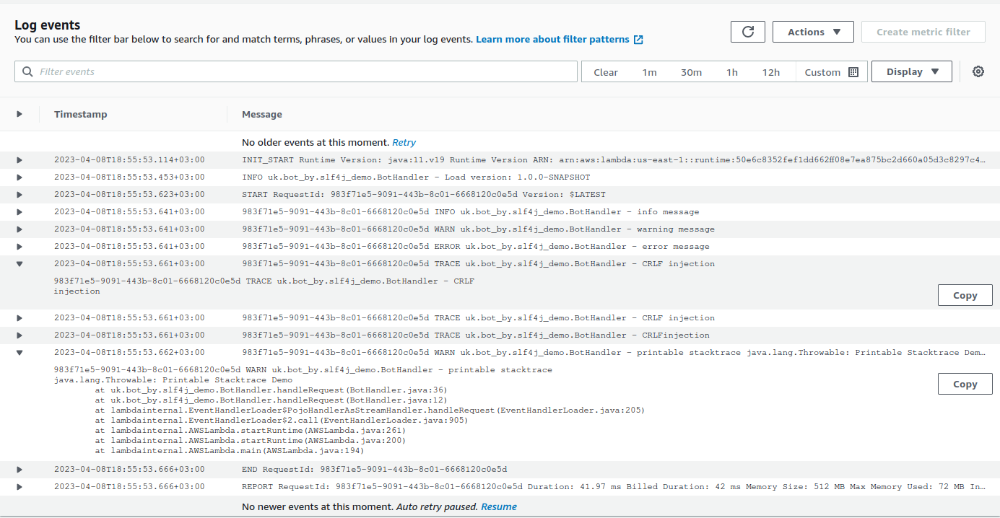
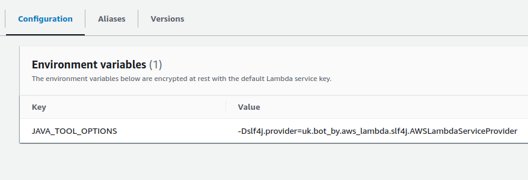

# SLF4J for AWS Lambda

An [SLF4J][] Logger implementation for [AWS Lambda][lambda]
and [CloudWatch][cloudwatch].

[![Codacy Badge][codacy-badge]][codacy-badge-link]
[![Codacy Coverage][codacy-coverage]][codacy-coverage-link]  
[![Libraries.io dependency status for GitHub repo][dependency-status]][dependencies]
[![Java Version][java-version]][jdk-download]

| Logger                           | Release                                                                                                                                                                                                               | Javadoc                                                                                                                                                                                             |
|----------------------------------|-----------------------------------------------------------------------------------------------------------------------------------------------------------------------------------------------------------------------|-----------------------------------------------------------------------------------------------------------------------------------------------------------------------------------------------------|
| **slf4j-aws-lambda-logger**      | [](https://search.maven.org/artifact/io.github.vitalijr2.aws-lambda/aws-lambda-slf4j-logger)           | [](https://javadoc.io/doc/io.github.vitalijr2.aws-lambda/aws-lambda-slf4j-logger)           |
| **slf4j-aws-lambda-json-logger** | [](https://search.maven.org/artifact/io.github.vitalijr2.aws-lambda/aws-lambda-slf4j-json-logger) | [](https://javadoc.io/doc/io.github.vitalijr2.aws-lambda/aws-lambda-slf4j-json-logger) |

## Table of Contents

* [Getting started](#getting-started)
  * [Usage](#usage)
  * [Configuration](#configuration)
  * [Setup a provider by a system property](#setup-a-provider-by-a-system-property)
* [Other solutions](#other-solutions)
* [Contributing](#contributing)
* [History](#history)
* [Authors and acknowledgment](#authors-and-acknowledgment)
* [License](#license)

Created by [gh-md-toc](https://github.com/ekalinin/github-markdown-toc)

## Getting started

Yet another SLF4J Simple, isn't it?

No, it isn't.

This implementation supports [MDC][mdc] to print out **AWS request ID**
in start of every logging record and supports [Markers][marker] too.
And the killer feature: it solves
the [CRLF issue](https://twitter.com/ben11kehoe/status/1264597451010433025)
described by Frank Afriat in
[Solving the Java Aws Lambda logging problem][aws-lambda-logging-problem] -
you don't have to prepare logging messages
and stacktraces to log them on CloudWatch Logs.

The footprint of **slf4j-aws-lambda** (88K) is same size
as **slf4j-simple** (79K) and much smaller than **logback** (888K).

### Usage

There is a great original [manual][manual].

The sample code:

```java

@Override
public String handleRequest(Map<String, Object> input, Context context) {
  MDC.put("@aws-request-id@", context.getAwsRequestId());

  logger.trace("trace message");
  logger.debug("debug message");
  logger.info("info message");
  logger.warn("warning message");
  logger.error("error message");

  var marker = new BasicMarkerFactory().getMarker("important");

  Stream.of("\n", "\r\n", "\r").forEach(injection -> {
    logger.trace(marker, "CRLF{}injection", injection);
  });

  logger.warn("printable stacktrace", new Throwable("Printable Stacktrace Demo"));
  return "done";
}
```

The log with **slf4j-aws-lambda-logger**:

```log
983f71e5-9091-443b-8c01-6668120c0e5d INFO io.github.vitalijr2.slf4j_demo.BotHandler - info message
983f71e5-9091-443b-8c01-6668120c0e5d WARN io.github.vitalijr2.slf4j_demo.BotHandler - warning message
983f71e5-9091-443b-8c01-6668120c0e5d ERROR io.github.vitalijr2.slf4j_demo.BotHandler - error message
983f71e5-9091-443b-8c01-6668120c0e5d TRACE io.github.vitalijr2.slf4j_demo.BotHandler - CRLF
injection
983f71e5-9091-443b-8c01-6668120c0e5d TRACE io.github.vitalijr2.slf4j_demo.BotHandler - CRLF
injection
983f71e5-9091-443b-8c01-6668120c0e5d TRACE io.github.vitalijr2.slf4j_demo.BotHandler - CRLF
injection
983f71e5-9091-443b-8c01-6668120c0e5d WARN io.github.vitalijr2.slf4j_demo.BotHandler - printable stacktrace
```

There is a JSON option with **slf4j-aws-lambda-json-logger**:

```json
{
  "level": "INFO",
  "logname": "io.github.vitalijr2.slf4j_demo.BotHandler",
  "message": "info message",
  "aws-request-id": "7b9af47e-d861-44b4-bde7-fa2e84ffb7cf"
}
{
  "level": "WARN",
  "logname": "io.github.vitalijr2.slf4j_demo.BotHandler",
  "message": "warning message",
  "aws-request-id": "7b9af47e-d861-44b4-bde7-fa2e84ffb7cf"
}
{
  "level": "ERROR",
  "logname": "io.github.vitalijr2.slf4j_demo.BotHandler",
  "message": "error message",
  "aws-request-id": "7b9af47e-d861-44b4-bde7-fa2e84ffb7cf"
}
{
  "level": "TRACE",
  "logname": "io.github.vitalijr2.slf4j_demo.BotHandler",
  "message": "CRLF\ninjection",
  "aws-request-id": "7b9af47e-d861-44b4-bde7-fa2e84ffb7cf"
}
{
  "level": "TRACE",
  "logname": "io.github.vitalijr2.slf4j_demo.BotHandler",
  "message": "CRLF\r\ninjection",
  "aws-request-id": "7b9af47e-d861-44b4-bde7-fa2e84ffb7cf"
}
{
  "level": "TRACE",
  "logname": "io.github.vitalijr2.slf4j_demo.BotHandler",
  "message": "CRLF\rinjection",
  "aws-request-id": "7b9af47e-d861-44b4-bde7-fa2e84ffb7cf"
}
{
  "stack-trace": "java.lang.Throwable: Printable Stacktrace Demo\n\tat io.github.vitalijr2.slf4j_demo.BotHandler.handleRequest(BotHandler.java:36)\n\tat io.github.vitalijr2.slf4j_demo.BotHandler.handleRequest(BotHandler.java:12)\n\tat lambdainternal.EventHandlerLoader$PojoHandlerAsStreamHandler.handleRequest(EventHandlerLoader.java:205)\n\tat lambdainternal.EventHandlerLoader$2.call(EventHandlerLoader.java:905)\n\tat lambdainternal.AWSLambda.startRuntime(AWSLambda.java:261)\n\tat lambdainternal.AWSLambda.startRuntime(AWSLambda.java:200)\n\tat lambdainternal.AWSLambda.main(AWSLambda.java:194)\n",
  "level": "WARN",
  "logname": "io.github.vitalijr2.slf4j_demo.BotHandler",
  "message": "printable stacktrace",
  "aws-request-id": "7b9af47e-d861-44b4-bde7-fa2e84ffb7cf"
}
```



### Configuration

The configuration is similar to [SLF4J Simple][slf4j-simple].

It looks for the `lambda-logger.properties` resource and read properties:

* **dateTimeFormat** - The date and time format to be used
  in the output messages. The pattern describing the date
  and time format is defined by [SimpleDateFormat][]. If the format is not
  specified or is invalid, the number of milliseconds since start up
  will be output.
* **defaultLogLevel** - Default log level for all instances of LambdaLogger.
  Must be one of (_trace_, _debug_, _info_, _warn_, _error_),
  a value is case-insensitive. If not specified, defaults to _info_.
* **levelInBrackets** - Should the level string be output in brackets?
  Defaults to `false`.
* **log.a.b.c** - Logging detail level for a LambdaLogger instance
  named _a.b.c_.
* **requestId** - Set the context name of AWS request ID.
  Defaults to `AWS_REQUEST_ID`.
* **showDateTime** - Set to `true` if you want the current date
  and time to be included in output messages. Defaults to `false`.
* **showLogName** - Set to `true` if you want the Logger instance name
  to be included in output messages. Defaults to `true`.
* **showShortLogName** - Set to `true` if you want the last component
  of the name to be included in output messages. Defaults to `false`.
* **showThreadId** - If you would like to output the current thread id,
  then set to `true`. Defaults to `false`.
* **showThreadName** - Set to `true` if you want to output
  the current thread name. Defaults to `false`.

The environment variables overrides the properties: **LOG_AWS_REQUEST_ID**,
**LOG_DATE_TIME_FORMAT**, **LOG_DEFAULT_LEVEL**, **LOG_LEVEL_IN_BRACKETS**,
**LOG_SHOW_DATE_TIME**, **LOG_SHOW_NAME**, **LOG_SHOW_SHORT_NAME**,
**LOG_SHOW_THREAD_ID**, **LOG_SHOW_THREAD_NAME**.

### Setup a provider by a system property

[SLF4J 2.0.9][slf4j.provider] allows a provider to be explicitly specified.
Since AWS Lambda Environment does not provide any configuration options
to set what options should be used on startup,
the [trick is to use the JAVA_TOOL_OPTIONS][java-tool-options-trick]
environment variable.

If your AWS Java Lambda has some SLF4J providers and you want
to point one of them, that needs to setup a System property
named `slf4j.provider`, as in the following:



## Other solutions

Other AWS centric loggers are [SLF4J/Logback Appender][awslambda-logback],
[slf4j-simple-lambda][], Logback's [CloudWatch appender][cloudwatch-appender]
and [CloudWatchLogs Java appender][cloudwatchlogs-java-appender].

## Contributing

Please read [Contributing](contributing.md).

## History

See [Changelog](changelog.md)

## Authors and acknowledgment

* Replace the custom output to stdout with AWS LambdaLogger, the main idea from
  @igorakkerman [SLF4J/Logback Appender][awslambda-logback].

## License

Copyright 2022-2024 Vitalij Berdinskih

Licensed under the Apache License, Version 2.0 (the "License");
you may not use this file except in compliance with the License.
You may obtain a copy of the License at

[http://www.apache.org/licenses/LICENSE-2.0][license]

Unless required by applicable law or agreed to in writing, software
distributed under the License is distributed on an "AS IS" BASIS,
WITHOUT WARRANTIES OR CONDITIONS OF ANY KIND, either express or implied.
See the License for the specific language governing permissions and
limitations under the License.

[Apache License v2.0](LICENSE)  
[](http://www.apache.org/licenses/LICENSE-2.0.html)

[SLF4J]: https://www.slf4j.org/

[lambda]: https://aws.amazon.com/lambda/

[cloudwatch]: https://aws.amazon.com/cloudwatch/

[codacy-badge]: https://app.codacy.com/project/badge/Grade/2c7cc1b8f6d7491283e13447594fdd82

[codacy-badge-link]: https://app.codacy.com/gh/vitalijr2/aws-lambda-slf4j/dashboard?utm_source=gh&utm_medium=referral&utm_content=&utm_campaign=Badge_grade

[codacy-coverage]: https://app.codacy.com/project/badge/Coverage/2c7cc1b8f6d7491283e13447594fdd82

[codacy-coverage-link]: https://app.codacy.com/gh/vitalijr2/aws-lambda-slf4j/dashboard?utm_source=gh&utm_medium=referral&utm_content=&utm_campaign=Badge_coverage

[dependency-status]: https://img.shields.io/librariesio/github/vitalijr2/aws-lambda-slf4j

[dependencies]: https://central.sonatype.com/artifact/io.github.vitalijr2.aws-lambda/aws-lambda-slf4j-logger/dependencies

[java-version]: https://img.shields.io/static/v1?label=java&message=11&color=blue&logo=java&logoColor=E23D28

[jdk-download]: https://www.oracle.com/java/technologies/javase-jdk11-downloads.html

[mdc]: https://www.slf4j.org/manual.html#mdc "Mapped Diagnostic Context (MDC)"

[marker]: https://www.slf4j.org/apidocs/org/slf4j/Marker.html

[aws-lambda-logging-problem]: https://frank-afriat.medium.com/solving-the-java-aws-lambda-logging-problem-305b06df457f "Solving the Java Aws Lambda logging problem"

[manual]: https://www.slf4j.org/manual.html "SLF4J user manual"

[slf4j-simple]: https://www.slf4j.org/api/org/slf4j/simple/SimpleLogger.html

[SimpleDateFormat]: https://docs.oracle.com/en/java/javase/11/docs/api/java.base/java/text/SimpleDateFormat.html

[slf4j.provider]: https://jira.qos.ch/browse/SLF4J-450 "[SLF4J-450]: Allow binding to be explicitly specified"

[java-tool-options-trick]: https://zenidas.wordpress.com/recipes/system-properties-for-a-java-lambda-function/ "System properties for a Java Lambda function"

[awslambda-logback]: https://github.com/jlib-framework/jlib-awslambda-logback "jlib AWS Lambda SLF4J/Logback Appender"

[slf4j-simple-lambda]: https://github.com/microlam-io/slf4j-simple-lambda

[cloudwatch-appender]: https://github.com/sndyuk/logback-more-appenders "Logback more appenders"

[cloudwatchlogs-java-appender]: https://github.com/boxfuse/cloudwatchlogs-java-appender

[license]: http://www.apache.org/licenses/LICENSE-2.0 "Apache License, Version 2.0"
